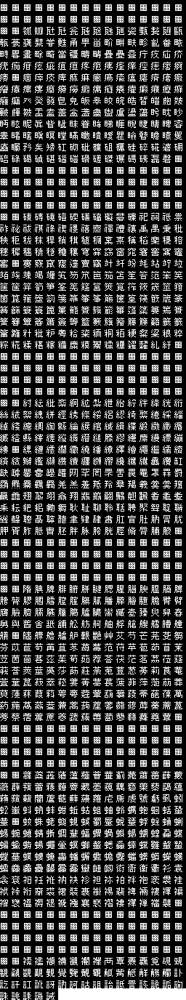

# treasure-conflix
English Patch for Treasure Conflix

# Treasure list

Id | Icon | Japanese | Unlocked after | Name | Clue/Map location | Clue
--- | --- | --- | --- | --- | --- | ---
01 |  | 不老不死の仙薬		| Stage 2 | Elixir of Life | Map in Landos Base
02 |  | 神文玉爾			| Stage 2 | Imperial Seal | Map in Raizeltown
03 |  | ドラゴンシールド	| Stage 2 | Dragon Shield | Map in Kazusa Base
04 |  | 大地神の鎧			| Stage 2 | Dojin Armor | Map in Peppermint
05 |  | サファイアの冠		| Stage 3 | Sapphire Crown | Map in Landos Base
06 |  | 呪縛の魔鏡			| Stage 2 | Cursed Mirror | Map in Fort Fatras
07 |  | 太陽の指輪			| Stage 2 | Sun Ring | Map in Peppermint
08 |  | 金の聖杯			| Stage 3 | Golden Chalice | Map in Peppermint
09 |  | 女神の像			| Stage 2 | Goddess Statue | From Nasca in the Cloud Temple | "Sacred inland sea, look at the surface from the southeast, it looks like a face in profile.  Hide despair in the eyes and hope behind the nose..."
10 |  | 金塊				| Stage 2 | Gold Bars | From Keane in Peppermint | "There's a mountain range outside of Landos Base.  Gold is hidden in one of the valleys."
11 |  | Ａ゛キャッツアイ	| Stage 2 | Cat's Eye | Kazusa Office | "The Doom Triangle... the magical sea that swallowed up many lives...  A wandering soul has lost its way in a large secluded forest and continues to drift.  In the depths of the forest, where no one approaches, lies a shining cat's eye."
12 |  | 白金の飾り灯篭		| Stage 2 | Platinum Lantern | From Fish in Fort Fatras | "A platinum lantern is buried in one of its four legs."
13 |  | 邪神の彫像			| Stage 2 | Evil God Statue | From Nasca in the Cloud Temple | "Sacred inland sea, look at the surface from the southeast, it looks like a face in profile.  Hide despair in the eyes and hope behind the nose..."
14 |  | アメジストの腕輪	| Stage 2 | Amethyst Bracelet | Kazusa Base Office | "The bracelet is torn in the valley of the mountains."
15 |  | ルビーの指輪		| Stage 2 | Ruby Ring | From Silva in Peppermint | "The ruby ring is a gift to the parents island, not the grandparents or grandchildren."
16 |  | エメラルドの指輪	| Stage 2 | Emerald Ring | Fort Fatras Office | "Where the trees cross, the emerald shines."
17 |  | 月光に光る石		| Stage 2 | Moonlight Stone | Landos Base Office | "On a barren island, stones shine in the moonlight."
18 |  | 銀の祭器			| Stage 1 | Silver Vessel | Kazusa Base Office | "There is a large mountain northwest of Kazusa Base.  In a clearing in the nearby woods, an ancient festival was held.  The silver ceremonial vessel that was used is still lost in that forest."
19 |  | 天使の弓矢			| Stage 2 | Angel's Bow | Fort Fatras Office | "An angel shoots an arrow at the spring that heals the burning pain of the throat.  The traveler falls asleep in the tree shade.”
20 |  | 魅惑の指輪			| Stage 2 | Enchanted Ring | Kazusa Base | "On the road to sneak up on the angry sea god, the ring shines on a cape."
21 |  | 銀の燭台			| Stage 2 | Silver Candelabra | Raizeltown Office | "When the sea haze clears, stand at the tip of the cape and look in the distance,  there is a large island nearby and a small island beyond.  Straight ahead is another island where I hid the treasure."  
22 |  | 古代宗教経典		| Stage 2 | Ancient Scriptures | Fort Fatras Office | "...that was lost in the northern canyon."
23 |  | 三つ目人のどくろ	| Stage 2 | Three-Eyed Skull | Peppermint | "Three-Eyed Skulls on Triplets Island."
24 |  | 金の髪飾り			| Stage 2 | Golden Barrette | Raizeltown Office | "The Golden Barrette is located at the base of the twisted arm."
25 |  | 真珠の首飾り		| Stage 1 | Pearl Necklace | Peppermint Office |
26 |  | 正史戦記			| Stage 1 | War Chronicle | Landos Base Office
27 |  | 黒珊瑚の首飾り		| Stage 1 | Black Coral Hairpin | Raizeltown Office | "There's a forest on the east coast. The Black Coral Hairpin is hidden somewhere there."
28 |  | 古代の通貨			| Stage 2 | Ancient Coin | Landos Base | "In a forest, between twin mountains surrounded by green..."
29 |  | 古代王朝の宝冠		| Stage 2 | Royal Crown | Underwater in the Doom Triangle
30 |  | 白鳳のつるぎ		| Stage 2 | Divine Sword | Underwater in the Doom Triangle
31 |  | ダイヤの指輪		| Stage 2 | Diamond Ring | Underwater in the Doom Triangle
32 |  | 金の腕輪			| Stage 2 | Gold Bracelet | Underwater in the Doom Triangle

# Treasure map

 

# Credits

Role | Name | -
--- | ---  | ---
Concept Design | 岡庭 真一郎 | Shinichiro Okaniwa
Story | 江藤 桂大 | Keita Etō
Main Program | 杉本 浩二 | Koji Sugimoto
Main Graphics | 本根 康之 | Yasuyuki Honne
Music Composer | 仲野 順也 | Junya Nakano
Visual Design | 直良 有祐 | Yusuke Naora
Enemy Sequence | 鈴木 敏章 | Toshiaki Suzuki
Enemy Graphics | 浜坂 真一郎 | Shinichiro Hamasaka
Event Program | 遠藤 利男 | Toshio Endo
Character Graphics | 林 真佐秋 | Masāki Hayashi 
World Map Graphics | 春木 あかね | Akane Haruki
Parameters | 岡崎 礼貴 | Hiroyoshi Okazaki
Auction Program | 松本 岳美 | Takemi Matsumoto
Sound Effect | 中村 栄治 | Eiji Nakamura
Sound Program | 赤尾 実 | Minoru Akao
Publicity | 山下 弘二   飯田 克信 | Koji Yamashita Katsunobu Iida
Special Thanks | 花田 憲昌   佐々木 洋勝 | Norimasa Hanada Hirokatsu Sasaki

# Translations

Data | File
--- | --- 
Bridge Menu | [translations/menus/14-equipment.txt](/treasure-conflix-gen/src/main/resources/translations/menus/14-equipment.txt)
Save Menu | [translations/menus/14-equipment.txt](/treasure-conflix-gen/src/main/resources/translations/menus/14-equipment.txt)
Load Menu | [translations/menus/14-equipment.txt](/treasure-conflix-gen/src/main/resources/translations/menus/14-equipment.txt)
Free Space Menu | [translations/menus/14-equipment.txt](/treasure-conflix-gen/src/main/resources/translations/menus/14-equipment.txt)
Manual Flight Menu | [translations/menus/05-manual-map-1.txt](/treasure-conflix-gen/src/main/resources/translations/menus/05-manual-map-1.txt) [translations/menus/05-manual-map-2.txt](/treasure-conflix-gen/src/main/resources/translations/menus/05-manual-map-2.txt)
Manual Combat Menu | [translations/menus/07-manual-combat-1.txt](/treasure-conflix-gen/src/main/resources/translations/menus/07-manual-combat-1.txt) [translations/menus/08-manual-combat-2.txt](/treasure-conflix-gen/src/main/resources/translations/menus/08-manual-combat-2.txt) [translations/menus/09-manual-combat-3.txt](/treasure-conflix-gen/src/main/resources/translations/menus/09-manual-combat-3.txt)
Manual Town Menu | [translations/menus/10-manual-town-1.txt](/treasure-conflix-gen/src/main/resources/translations/menus/10-manual-town-1.txt) [translations/menus/11-manual-town-2.txt](/treasure-conflix-gen/src/main/resources/translations/menus/11-manual-town-2.txt) [translations/menus/12-manual-town-3.txt](/treasure-conflix-gen/src/main/resources/translations/menus/12-manual-town-3.txt) [translations/menus/13-manual-town-4.txt](/treasure-conflix-gen/src/main/resources/translations/menus/13-manual-town-4.txt)
Equipment Menu | [translations/menus/14-equipment.txt](/treasure-conflix-gen/src/main/resources/translations/menus/14-equipment.txt)
Equipment List | [translations/menus/15-equipment-list.txt](/treasure-conflix-gen/src/main/resources/translations/menus/15-equipment-list.txt)
Introduction | [translations/menus/16-introduction.txt](/treasure-conflix-gen/src/main/resources/translations/menus/16-introduction.txt)
GPS Town Names | [translations/menus/17-locations.txt](/treasure-conflix-gen/src/main/resources/translations/menus/17-locations.txt)

Restrictions:
Menu : Max length 43 characters (no margin).
Equipment names : Max length 19 characters.
GPS Town Names: The length of each hardcoded in MenuReader.java (to be improved).

Screen | File
--- | --- 
Raizeltown | [85B89.txt](treasure-conflix-gen/src/main/resources/translations/85B89.txt)
Raizeltown (Office) | [85131.txt](treasure-conflix-gen/src/main/resources/translations/85131.txt)
Melk's Workshop | [860A5.txt](treasure-conflix-gen/src/main/resources/translations/860A5.txt)
Melk's Workshop Menu Equipment List | [84905.txt](treasure-conflix-gen/src/main/resources/translations/84905.txt)
Bridge | [8A5AB.txt](treasure-conflix-gen/src/main/resources/translations/8A5AB.txt)
Bridge (endgame) | [8C421.txt](treasure-conflix-gen/src/main/resources/translations/8C421.txt)
Landos Base | [86BA2.txt](treasure-conflix-gen/src/main/resources/translations/86BA2.txt)
Landos Base (Office) | [8666D.txt](treasure-conflix-gen/src/main/resources/translations/8666D.txt)
Shady Auction Hall | [8AE2B.txt](treasure-conflix-gen/src/main/resources/translations/8AE2B.txt)
Treasure List Auction Bones | [84100.txt](treasure-conflix-gen/src/main/resources/translations/84100.txt)
Kazusa Base | [87876.txt](treasure-conflix-gen/src/main/resources/translations/87876.txt)
Kazusa Base (Office) | [871DF.txt](treasure-conflix-gen/src/main/resources/translations/871DF.txt)
Peppermint | [88AE2.txt](treasure-conflix-gen/src/main/resources/translations/88AE2.txt)
Peppermint (Office) | [88507.txt](treasure-conflix-gen/src/main/resources/translations/88507.txt)
Serge's Workshop | [890E7.txt](treasure-conflix-gen/src/main/resources/translations/890E7.txt)
Fort Fatras | [8809C.txt](treasure-conflix-gen/src/main/resources/translations/8809C.txt)
Fort Fatras (Office) | [87CAE.txt](treasure-conflix-gen/src/main/resources/translations/87CAE.txt)
Sunken Ship 1 | [8AD80.txt](treasure-conflix-gen/src/main/resources/translations/8AD80.txt)
Sunken Ship 2 | [8ADA7.txt](treasure-conflix-gen/src/main/resources/translations/8ADA7.txt)
Sunken Ship 3 | [8ADE5.txt](treasure-conflix-gen/src/main/resources/translations/8ADE5.txt)
Inside a cave | [8AE04.txt](treasure-conflix-gen/src/main/resources/translations/8AE04.txt)
Hidden Village | [89A1A.txt](treasure-conflix-gen/src/main/resources/translations/89A1A.txt)
Salvage Ship | [8934B.txt](treasure-conflix-gen/src/main/resources/translations/8934B.txt)
Rag's Workshop | [8987B.txt](treasure-conflix-gen/src/main/resources/translations/8987B.txt)
Cloud Temple | [8A151.txt](treasure-conflix-gen/src/main/resources/translations/8A151.txt)
Conqueror's Altar | [8A473.txt](treasure-conflix-gen/src/main/resources/translations/8A473.txt)

# Unused data

When you're idle on the title screen, you get a demo reel presenting all the characters. 
In the data, there is an extra character called Bayu, absent from the game:

Japanese | English
--- | --- 
バユウ | Bayuu
ショップのジジィ。 | Old man in a shop
どこにでもいるオッサン | Ordinary middle-aged man
７２歳　男性　未婚 | 72, male, single

Offset: 78EF-7946

# Memory Mapping

Offset | Content | Comment
--- | --- | ---
095B7-0AC5F | Texts for: - introduction -continue screen - save screen - ship or item names?  | Decompressed to 7E4800 Encoded in SJIS
14DB0-14E6F Dialog box |  | Tiles
14E70-14F6F Info box |  | Tiles
18000-1802F  | 19000	19EBA	1AD1D	1B832	1C6A8	1D5D9	1B832	1C6A8	1DFF9	1DFF9	1DFF9	1DFF9	1DFF9	1DFF9	1DFF9	19EBA	 | 16 Pointers
18100-1812F  | 20000	2079D	20D69	2154F	21999	21E64	2154F	21999	22693	22693	22693	22693	22693	22693	22693	2079D	 | 16 Pointers
18200-1822F  | 1E29C	1E6D9	1EA16	1EC69	1EEAD	1EF9A	1EC69	1EEAD	1F227	1F227	1F227	1F227	1F227	1F227	1F227	1E6D9	 | 16 Pointers
18300-1832F  | 1F2BB	1F37A	1F470	1F59B	1F6C1	1F75F	1F59B	1F6C1	1F8A0	1F8A0	1F8A0	1F8A0	1F8A0	1F8A0	1F8A0	1F37A	 | 16 Pointers
18400-1842F  | 2316C	26C83	278CE	2862C	2917A	2938E	2862C	2917A	29D25	29D25	29D25	29D25	29D25	29D25	29D25	26C83	 | 16 Pointers
18500-1852F  | 22A39	22BC2	22C4F	22D07	22D9E	22F86	22D07	22E92	23086	23086	23086	23086	23086	23086	23086	22BC2	 | 16 Pointers
18600-1862F  | 30000	40000	44197	30003	34F55	39F3C	4B421	4B421	4B421	4B421	4B421	4B421	4B421	4B421	4B421	40000	 | 16 Pointers
18700-1872F  | 3E600	3E603	3E706	3E7FC	3E8DC	3E9FB	3EB98	3EACB	3EACB	3EACB	3EACB	3EACB	3EACB	3EACB	3EACB	3E603	 | 16 Pointers
1F2BB-1F379 Sky Sprite |  | Compressed Tiles
50000-5001A | 60000	633CF	6678E	68B23	6A6B5	6C4E5	50300	51D9C	54608 | 9 pointers
50100-50123 | 56148	5651F	56981	56DA1	57078	5746D	5789F	57CD7	6E300	6E770	6EC15	6F081 | 12 pointers
50200-50220 | 6F53C	6F607	6F706	6F7FB	6F8CE	6F9C8	6F9FF	6FAE2	6FBCB	6FC78	6FD50 | 11 pointers
51D9C-54607 Room 3 |  | Compressed Tiles
54608-56147 Room 2 |  | Compressed Tiles
56148-5651E Room 1 |  | Compressed Tile map for tiles 68B23
5651F-56980 Room 4 |  | Compressed Tile map for tiles 60000
5789F-57CD6 Room 3 |  | Compressed Tile map for tiles 51D9C
60000-633CE Room 4 |  | Compressed Tiles
68B23-6A6B4 Room 1 |  | Compressed Tiles
6E770-6EC14 Room 2 |  | Compressed Tile map for tiles 54608
70100-76878 Character sprites  |  | Compressed Tiles
76A00-7A569 Sprites  |  | Compressed Tiles
7A600-7B0FD Texts  |  | Compressed Tiles 4bpp (Width: 8)
7B100-7B119 | ? | Pointers
7B200-7B796 | ? | ? 
7B797-7B80A | ? | ?
7B80B-7B894 | ? | ?
7B895-7C030 | ? | ?
7C031-xxxxx | ? | ?
7C302-xxxxx | ? | ?
7C8F5-7CCB7 | ? | Compressed Tile map
7CCB8-7CF63 | ? | Compressed Tile map
7CF64-7D25A | ? | Compressed Tile map
7D25B-7D30B | ? | Compressed Tile map ?
7D30C-7D657 | ? | Compressed Tile map ?
7D658-7DA86 | ? | Compressed Tile map ?
7DA87-7DB1E | ? | Compressed Tile map ?
7E200-7FFFF | ? | ?
A0380-A03A7
A03A8-A03EE  |  | Compressed 
A1DFD-A5706 Title screen |  | Compressed Tiles
A5720-A5A39 Title screen |  | Compressed Tile map for tiles A1DFD
A5A3A-A5D02 Title screen |  | Compressed Tile map for tiles A1DFD
A5D03-A5DD9 Title screen |  | Compressed Tile map for tiles A1DFD
AAA78-AE4C3 Continue screen |  | Compressed Tiles
AE4C4-AEA4F Continue screen |  | Compressed Tile map for tiles AAA78
B0000-B05CA Ship Sprite |  | Compressed Tiles
B0616-B06AA
B06AB-B0FCF Mode 7 texts sprite |  | Compressed Tiles
B0FD0-B173D Mode 7 texts sprite |  | Compressed Tiles
B173E-B18C4 Text sprites |  | Compressed Tiles
B19C7-B6C44 Intro screen |  | Compressed Tiles
B6C45-B6ED9 Intro screen |  | Compressed Tile map for tiles B19C7
B6ED8-B7151 Intro screen |  | Compressed Tile map for tiles B19C7
B7150-B74A7 Intro screen |  | Compressed Tile map for tiles B19C7
B7657-B9DF3 Intro screen |  | Compressed Tiles
B9DF4-BA14C Intro screen |  | Compressed Tile map for tiles B7657
F6644-F82B7 Intro screen |  | Compressed Tiles
F82B8-F86A5 Intro screen |  | Compressed Tile map for tiles F6644

# Font Mapping

The game uses the font provided in the BS-X bios. 
This font is mostly mapped on the Shift-JIS standard where every character is coded by two bytes. 
Not part of the SJIS:
* 8-pixel wide latin characters.
* 8-pixel wide katakanas (commonly known as [half-width kanas](https://en.wikipedia.org/wiki/Half-width_kana)).

[Shift-JIS Complete Table](http://www.rikai.com/library/kanjitables/kanji_codes.sjis.shtml)

Offset | Content | Comment
--- | --- | ---
48000-50000 |  | Kanjis: 88 9F 89 40 8A 40 8B 40 - 8B 5B
50000-58000 |  | Kanjis: 8B 5C - 8B xx 8C 40 8D 40 8E 40 8F 40 90 40 - 90 B0 
58000-60000 |  | Kanjis: 90 B1 - 90 xx 91 40 92 40 93 40 94 40 95 40
60000-68000 |  | Kanjis: 96 40 97 40 98 40 99 40 9A 40 9B 40
68000-70000 |  | Kanjis: 9C 40 9D 40 9E 40 9F 40 E0 40
70000-78000 |  | Kanjis: E1 40 E2 40 E3 40 E4 40 E5 40 E6 40
78000-80000 |  | Kanjis: E7 40 E8 40 E9 40 EA 40
